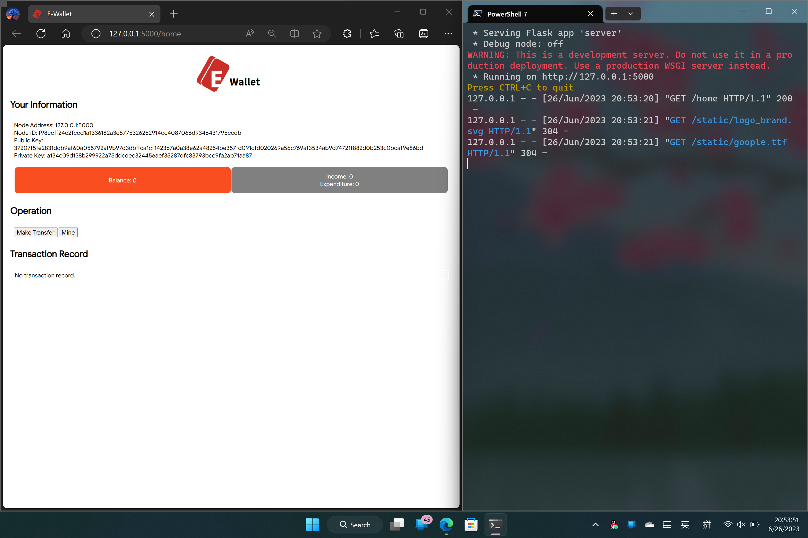

[English](README.md) | 简体中文
# E-Wallet
## 介绍
E-Wallet 是一个基于区块链技术的简单加密电子钱包系统。

此项目仅用于学习研究，请不要在实际生产环境中部署此项目。

E-Wallet 使用 Flask 网络框架以及国密 SM2 加密算法。

目前，E-Wallet 主要支持以下功能：
- 在局域网部署新节点
- 去中心化的转账操作
- 简陋的可视化用户操作界面
- 挖矿
- 使用 SM2 加密账单

## 屏幕截图


## 安装
```shell
pip install -r requirements.txt
```

## 详细说明
请点击[这里](https://share.weiyun.com/F8MrxOON)阅读。